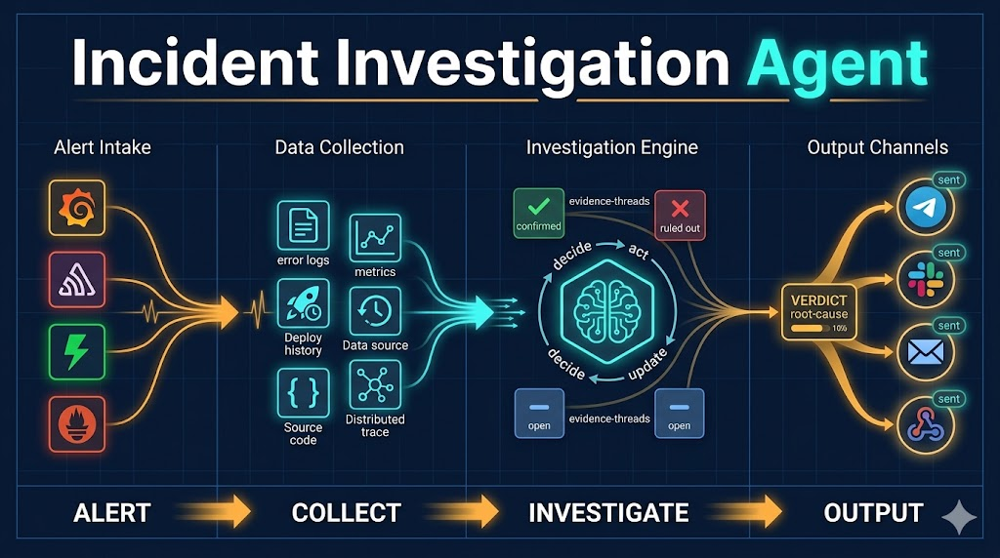
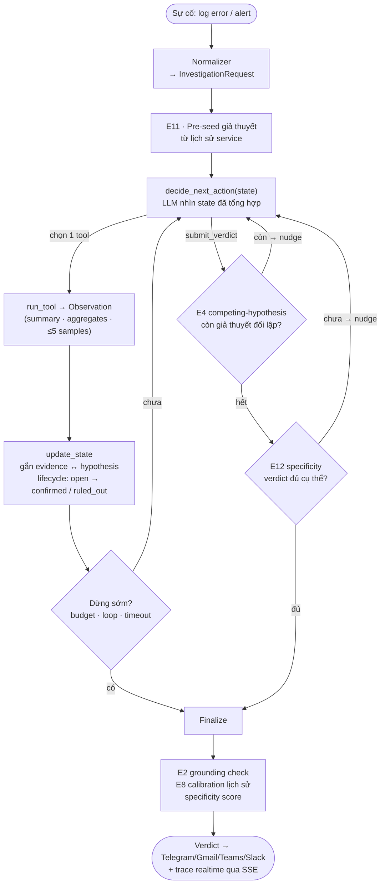
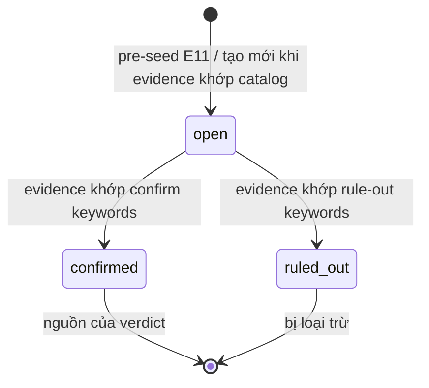
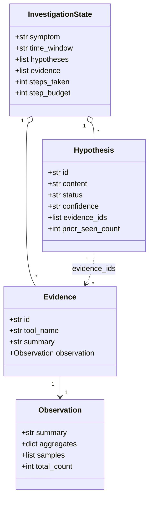

# Agent điều tra nguyên nhân sự cố



> Đưa vào một sự cố (log error hoặc alert) → agent tự truy nguồn từ **deploy history,
> logs, metrics và source code** → suy luận qua từng bước adaptive để khoanh vùng
> nguyên nhân → trả về verdict dựa trên bằng chứng (evidence-grounded), kèm chuỗi bằng
> chứng truy ngược được.

**Live demo:** https://your-agent.agentbase-runtime.aiplatform.vngcloud.vn *(deploy trên GreenNode AgentBase)*

---

## Vấn đề

Khi microservice có sự cố, kỹ sư on-call phải lục qua nhiều nguồn cùng lúc — log lỗi,
metrics, lịch sử deploy, source code — rồi tự ghép các dấu hiệu lại thành nguyên nhân
gốc rễ. Việc đó thường mất 20–60 phút, và phần khó nhất không phải thiếu dữ liệu, mà là
biết *nhìn vào đúng chỗ* theo đúng thứ tự.

Agent này hỗ trợ kỹ sư on-call làm đúng vòng lặp đó, tự động: nhận triệu chứng, tự sinh
giả thuyết, gọi tool thu thập bằng chứng theo từng bước, loại trừ dần từng khả năng, và
kết thúc bằng một verdict có chuỗi bằng chứng truy ngược được — trong vài phút thay vì
vài chục phút.

**Nguồn điều tra:** deploy history · application logs · metrics · distributed traces ·
dependency graph · **source code** (đọc read-only qua external MCP — GitHub/GitLab).

---

## Cách agent hoạt động

```
Input: một sự cố
 ├─ Chat thủ công (CLI / dashboard)
 └─ Webhook: Grafana · Prometheus · Sentry · PagerDuty · OpsGenie
            │
            ▼
┌───────────────────────────────────────────────────────────────┐
│                       INVESTIGATION ENGINE                    │
│                                                               │
│  1. Pre-seed giả thuyết từ lịch sử service (E11)             │
│                                                               │
│  ┌─────────────────────────────────────────────────────────┐  │
│  │            VÒNG LẶP ADAPTIVE (budget 10 bước)           │  │
│  │                                                         │  │
│  │  decide_next_action(state)                              │  │
│  │  LLM thấy: triệu chứng · bảng giả thuyết hiện tại      │  │
│  │            · observation vừa thu · gợi ý tool (E10)    │  │
│  │  → chọn đúng 1 tool, hoặc gọi submit_verdict           │  │
│  │                        │                               │  │
│  │         ┌──────────────▼──────────────┐                │  │
│  │         │   run_tool → Observation    │                │  │
│  │         │   (logs/metrics/deploy/     │                │  │
│  │         │    code/trace/deps)         │                │  │
│  │         │   summary · aggregates      │                │  │
│  │         │   ≤5 samples · total_count  │                │  │
│  │         └──────────────┬──────────────┘                │  │
│  │                        │                               │  │
│  │  update_state: gắn bằng chứng → giả thuyết             │  │
│  │  lifecycle: open → confirmed / ruled_out               │  │
│  │                                                         │  │
│  │  GATE trước khi chấp nhận verdict:                     │  │
│  │  • E4: competing-hypothesis — còn giả thuyết đối lập  │  │
│  │        nào chưa loại trừ không?                        │  │
│  │  • E12: specificity — verdict đã đủ cụ thể chưa?      │  │
│  │                                                         │  │
│  │  DỪNG khi: verdict qua gate · hết budget               │  │
│  │           · phát hiện loop · timeout                   │  │
│  └─────────────────────────────────────────────────────────┘  │
│                        │                                       │
│  Finalize:                                                     │
│  • E2: grounding check — hạ confidence nếu overlap thấp      │
│  • E8: calibration lịch sử — hạ nếu accuracy loại này thấp   │
│  • E9: structured verdict — không qua text round-trip         │
└───────────────────────────────────────────────────────────────┘
            │
            ▼
Verdict: root_cause · confidence · chuỗi bằng chứng · propagation
            │
            ▼
Output: Telegram · Gmail · Teams · Slack   (mỗi project cấu hình kênh riêng)
            │
            └─→ Mọi bước được trace vào DB + stream qua SSE lên live dashboard
```

### Từng bước

**1. Input** — Hai cách đưa sự cố vào: **chat thủ công** (CLI REPL / dashboard) hoặc
**webhook** từ Grafana, Prometheus, Sentry, PagerDuty, OpsGenie. Normalizer chuẩn hóa
mọi nguồn về cùng một `InvestigationRequest` (symptom, time_window, project_id).

**2. Pre-seed (E11)** — Trước bước đầu tiên, engine tra `investigation_patterns` của
service này để gieo trước các giả thuyết `open` từ những root-cause type đã từng gặp.
Agent được định hướng nhưng vẫn phải thu bằng chứng thật để xác nhận.

**3. Vòng lặp adaptive** — Mỗi bước là một chuỗi hàm pure:

- `decide_next_action(state)` — LLM nhận *state đã tổng hợp* (không phải lịch sử thô):
  bảng giả thuyết + observation gần nhất + gợi ý tool theo giả thuyết open (E10) + số
  bước còn lại. LLM chọn đúng 1 tool, hoặc gọi `submit_verdict`.

- `run_tool → Observation` — tool tự aggregate ở tầng query (logs, metrics, deploy,
  dependency, distributed trace, hoặc source code qua MCP) và trả về cấu trúc:
  `summary` (tự diễn giải, signal lên đầu) · `aggregates` · `≤5 samples` ·
  `total_count`. **LLM không bao giờ thấy raw rows.**

- `update_state` — bằng chứng được gắn vào giả thuyết qua `evidence_ids`; vòng đời
  (lifecycle) giả thuyết tiến theo catalog của domain (E6): `open → confirmed /
  ruled_out`.

**4. Hai gate trước verdict** — Mỗi gate chỉ kích một lần (idempotent):

- **Competing-hypothesis gate (E4):** nếu confidence high/medium mà vẫn còn giả thuyết
  đối lập chưa loại trừ → inject nudge "hãy loại trừ X, Y trước khi kết luận."
- **Specificity gate (E12):** nếu verdict thiếu chi tiết cụ thể (version, timestamp,
  %, baseline) → nudge bổ sung.

**5. Verdict** — `submit_verdict` là một tool trong schema; LLM điền đầy đủ các field
có cấu trúc. Sau đó:

- **Grounding check (E2):** nếu từ khóa của root_cause overlap < 25% với bằng chứng đã
  thu → hạ confidence 1 bậc + đánh dấu `speculative`.
- **Calibration lịch sử (E8):** nếu accuracy lịch sử của loại giả thuyết này dưới
  ngưỡng → hạ tiếp.
- **Confidence căn cứ theo *loại* bằng chứng** — không phải số %:
  `high` = tương quan thời gian + cơ chế nhân quả rõ;
  `medium` = chỉ tương quan thời gian;
  `low` = suy đoán;
  `insufficient` = chưa đủ bằng chứng (là một kết quả hợp lệ).

**6. Output & trace** — Verdict được push tới các kênh cấu hình theo project (Telegram,
Gmail, Teams, Slack). Đồng thời, mọi bước điều tra — từng tool call, từng observation,
từng lần đổi trạng thái giả thuyết — đều được trace vào DB và stream realtime qua SSE,
nên có thể xem lại chính xác agent đã suy luận thế nào để ra verdict.

---

## Agent engine — đi sâu

Quyết định trung tâm của engine: state luôn giữ một *bức tranh giả thuyết đang tiến
hóa*, trong đó **giả thuyết và bằng chứng liên kết với nhau** — không phải hai danh
sách rời. Loop adaptive cập nhật bức tranh đó, logic dừng đọc nó, và verdict chỉ là
cách *trình bày lại* nó. Tách rời hai thứ này là tự chặn đường ở khâu verdict.

### Control flow của vòng lặp

Engine không phải một chuỗi gọi tool tuyến tính — nó là vòng lặp có điểm rẽ. Điểm
khác biệt nằm ở **hai gate chặn giữa "LLM muốn kết luận" và "verdict được chấp nhận"**:
khi LLM gọi `submit_verdict`, verdict chưa được nhận ngay mà phải qua gate; nếu chưa
đạt, engine *inject một nudge* và đẩy LLM quay lại loop để điều tra thêm.



Mỗi gate chỉ kích **một lần** (idempotent) và có budget-guard — không bao giờ đẩy agent
vào vòng lặp nudge vô tận. Đây là đối sách chính cho việc model tầm trung hay *dừng quá
sớm*: vừa thấy một manh mối hợp lý là muốn chốt ngay.

### Vòng đời giả thuyết

Mỗi giả thuyết đi qua một máy trạng thái đơn giản, do **catalog của domain** điều khiển
(E6 — không hard-code trong engine). Confirm/rule-out được quyết bởi keyword trong
summary của Observation mới, và mỗi lần chuyển trạng thái đều gắn thêm `evidence_ids`.



Khi dừng mà có nhiều giả thuyết `confirmed`, engine chọn winner theo confidence rồi tới
số lượng evidence (multi-agent conflict resolution), và annotate lại trong verdict.

### Mô hình dữ liệu — vì sao verdict luôn truy ngược được

`InvestigationState` là dataclass thuần dữ liệu. Liên kết `Hypothesis.evidence_ids →
Evidence → Observation` chính là thứ làm cho mỗi kết luận đều dẫn ngược được về dữ liệu
gốc đã sinh ra nó.



`status` ∈ `open / confirmed / ruled_out`; `confidence` ∈ `high / medium / low`. Vì
verdict đọc lại đúng cấu trúc này, grounding check (E2) có thể đối chiếu từ khóa
root_cause với toàn bộ `Evidence.summary` đã thu — nếu overlap quá thấp, confidence bị
hạ và verdict bị đánh dấu `speculative`.

### Đối sách cho model tầm trung

Phần lớn công sức của engine dồn vào việc *bù* các điểm yếu của model tầm trung, thay vì
giả định một model hoàn hảo:

| Bẫy | Đối sách trong engine |
|-----|------------------------|
| Chọn sai tool | `description` sắc, phân biệt rõ khi nào dùng tool nào |
| Lặp vô hạn | Phát hiện loop (2 call giống nhau / dao động A→B→A→B) + nhắc "đã chạy rồi"; budget là chặn cứng |
| Dừng quá sớm | Competing-hypothesis gate (E4) buộc loại trừ giả thuyết đối lập trước khi chốt |
| Bịa nguyên nhân | Grounding check (E2) — root_cause không gắn được bằng chứng → hạ confidence |
| Verdict mơ hồ | Specificity gate (E12) đòi version/timestamp/%/baseline cụ thể |
| Đánh giá sai quy mô | `total_count` + `truncated` trong Observation cho thấy quy mô thật |

---

## Các quyết định thiết kế chủ chốt

- **Tool distillation — LLM không bao giờ thấy dữ liệu thô.**
  Tool tự aggregate bằng SQL và trả về `Observation` gồm summary tự diễn giải +
  aggregates + ≤5 samples + `total_count`. Đây là guardrail quan trọng nhất chống
  hallucinate root cause: agent không thể bịa nguyên nhân từ dữ liệu nó chưa từng nhận.

- **Engine domain-agnostic, catalog pluggable.**
  Engine không biết "microservice" hay "fintech" là gì — nó chỉ thấy `list[Tool]` đồng
  nhất và một hypothesis catalog. Đổi catalog (và tools) là đủ để áp dụng cùng engine
  cho domain khác. Repo hiện có hai catalog: microservice ops và fintech anomaly.

- **Vòng lặp adaptive, không plan-ahead.**
  Mỗi bước LLM thấy state đã tổng hợp, không phải lịch sử hội thoại thô. Không vạch kế
  hoạch trước; bước sau phụ thuộc kết quả bước trước — đúng bản chất điều tra sự cố, và
  giữ mỗi quyết định đủ đơn giản cho model tầm trung.

- **Verdict dựa trên bằng chứng (evidence-grounded).**
  Mỗi giả thuyết giữ danh sách `evidence_ids` trỏ vào observation cụ thể đã thu. Verdict
  phải qua grounding check trước khi được chấp nhận. "Chưa đủ bằng chứng" là kết quả hợp
  lệ — một agent khiêm tốn đúng lúc đáng tin hơn agent luôn quả quyết.

---

## Chạy thử

```bash
git clone <repo> && cd Clawathon
python3 -m venv .venv && source .venv/bin/activate
pip install -r requirements.txt
cp .env.example .env           # điền ANTHROPIC_API_KEY
make init && make seed         # khởi tạo DB + 6 kịch bản demo
make run                       # server tại http://localhost:8080
make trigger sc=1              # trigger kịch bản 1 (deploy bug)
# hoặc chat thủ công với agent:
make chat
```

Mở **http://localhost:8080/dashboard** — xem investigation chạy từng bước qua SSE, kèm
verdict và chuỗi bằng chứng cuối cùng.

**6 kịch bản sẵn có:**

| # | Kịch bản | Kết quả |
|---|----------|---------|
| `sc=1` | Deploy bug: payment-gateway v2.3.1 → lỗi 502 | 5 bước, HIGH |
| `sc=2` | DB pool exhaustion: auth-service → timeout | 8 bước, HIGH |
| `sc=3` | Provider sập: MoMo gateway → thanh toán thất bại | 6 bước, HIGH |
| `sc=4` | Traffic surge 5× → rate limit api-gateway | 3 bước, HIGH |
| `sc=f1` | Fintech: processor timeout → giao dịch thất bại | multi-agent |
| `sc=f2` | Fintech: lỗi giá merchant → doanh thu lệch | multi-agent |

Endpoint thủ công:
```bash
curl -X POST localhost:8080/trigger \
  -H "Content-Type: application/json" \
  -d '{"service":"payment-gateway","scenario":"scenario1","time_window":"14:00-15:00"}'

curl localhost:8080/health
```

---

## Stack

| Thành phần | Hiện thực |
|-----------|-----------|
| Ngôn ngữ | Python 3.14 |
| Agent loop | Tự viết (adaptive) + LangGraph (hot-swap, cùng interface) |
| LLM | Anthropic Claude — OpenAI-compat: Groq, Mistral, GreenNode MaaS |
| Storage | SQLite WAL (dev) · PostgreSQL (prod) — qua storage seam |
| API server | FastAPI + uvicorn |
| MCP protocol | JSON-RPC 2.0 over HTTP, hot-plug per project |
| Nguồn dữ liệu | logs · metrics · deploy history · dependencies · traces · source code (MCP) |
| Output | Telegram · Gmail · Teams · Slack — fan-out router, cấu hình per project |
| Trace | trace_events lưu DB + SSE realtime lên dashboard |
